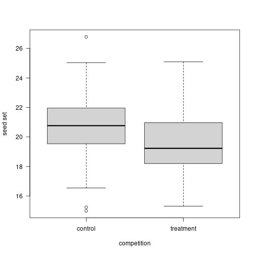
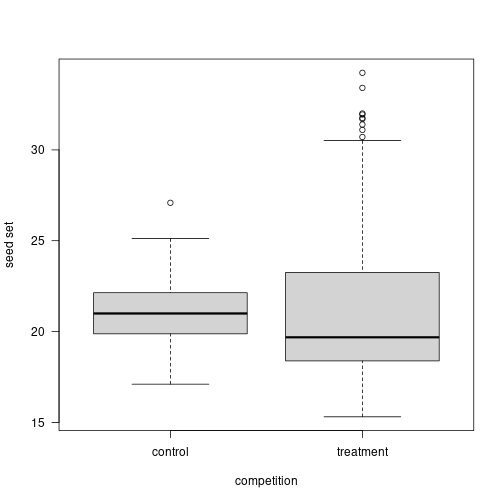

Common Sense Statistics
========================================================
author: Ignasi Bartomeus
date: September 2022
autosize: true

Common Sense Statistics
========================================================


Common Sense Statistics
========================================================

> "He uses statistics as a drunken man uses lamp-posts... for support rather than illumination." - Andrew Lang (1844-1912)

Have a question
========================================================

Goal:

- exploratory analysis
- null hypothesis testing
- assessing the plausibility of different models
- interested in the model predictive power

Have a question
========================================================


Do not expect statistics to be easy
========================================================

- Dynamic field
- Opinionated field
- No cookbooks

> “If you only have a hammer, all your problems will look like nails”

(but do not overdue it -> statistical machismo)


Do not expect statistics to be easy
========================================================


Do not expect statistics to be easy
========================================================


Be aware that statistical analysis can hardly fix a bad experimental design or poorly collected data.
========================================================

> "calling a statistician after the data has been collected is like calling a doctor to do an autopsia"

- Experimenta design
- Sample size
- (Power analysis)

Learn about researchers degrees of freedom
========================================================

- The Garden of forking paths
- p-hacking
- Pre-registration?


Always plot your data
========================================================


Always plot your data
========================================================


Understand the statistical test you are performing
========================================================

- model assumptions
- default parameters
- toy datasets
- interpretation

Provide the full details of your statistical analyses.
========================================================

- Report all test and data manipulation
- Frequentist: P-value, sample size, estimates and associated errors (SE or CI), coefficient of determination (r2), and interpretable effect sizes.
- Do not create Post-hoc hypothesis
- Bayesian CI's ~ p-values


Biological significance > statistical significance
========================================================


Biological significance > statistical significance
========================================================


```

Call:
lm(formula = d$values ~ d$treatment)

Residuals:
    Min      1Q  Median      3Q     Max 
-5.7940 -1.3562 -0.2033  1.2013  6.0050 

Coefficients:
                     Estimate Std. Error t value Pr(>|t|)    
(Intercept)           20.7825     0.2037 102.036  < 2e-16 ***
d$treatmenttreatment  -1.0960     0.2880  -3.805 0.000189 ***
---
Signif. codes:  0 '***' 0.001 '**' 0.01 '*' 0.05 '.' 0.1 ' ' 1

Residual standard error: 2.037 on 198 degrees of freedom
Multiple R-squared:  0.06814,	Adjusted R-squared:  0.06343 
F-statistic: 14.48 on 1 and 198 DF,  p-value: 0.0001889
```

Biological significance > statistical significance
========================================================



Biological significance > statistical significance
========================================================


```

Call:
lm(formula = d$values ~ d$treatment)

Residuals:
    Min      1Q  Median      3Q     Max 
-6.3779 -2.6385 -0.7762  1.1683 12.5558 

Coefficients:
                     Estimate Std. Error t value Pr(>|t|)    
(Intercept)           21.1198     0.4244  49.758   <2e-16 ***
d$treatmenttreatment   0.5667     0.5695   0.995    0.321    
---
Signif. codes:  0 '***' 0.001 '**' 0.01 '*' 0.05 '.' 0.1 ' ' 1

Residual standard error: 3.796 on 178 degrees of freedom
Multiple R-squared:  0.005532,	Adjusted R-squared:  -5.467e-05 
F-statistic: 0.9902 on 1 and 178 DF,  p-value: 0.321
```

Biological significance > statistical significance
========================================================



Practice Open Science and reproducibility
========================================================

- Document choices (Git)
- Pair programming
- Code review
- Errors are fine as long as are honest and we catch them.


Common Sense Stastistics
========================================================
- Have a question
- Do not expect statistics to be easy
- Be aware that statistical analysis can hardly fix a bad experimental design or poorly collected data
- Learn about researchers degrees of freedom
- Always plot your data
- Understand the statistical test you are performing
- Provide the full details of your statistical analyses
- Biological significance > statistical significance
- Practice Open Science and reproducibility
